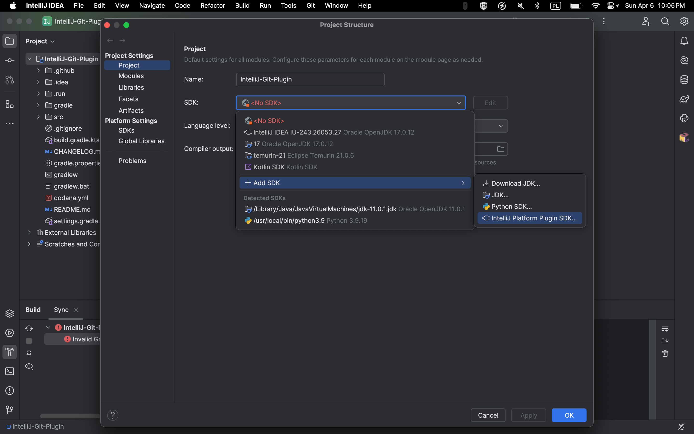
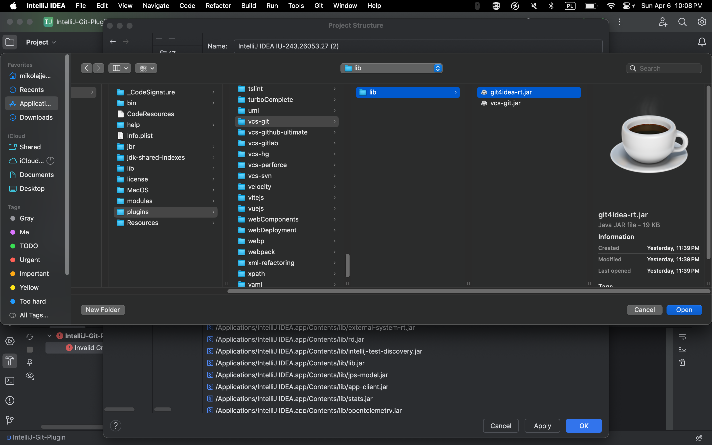
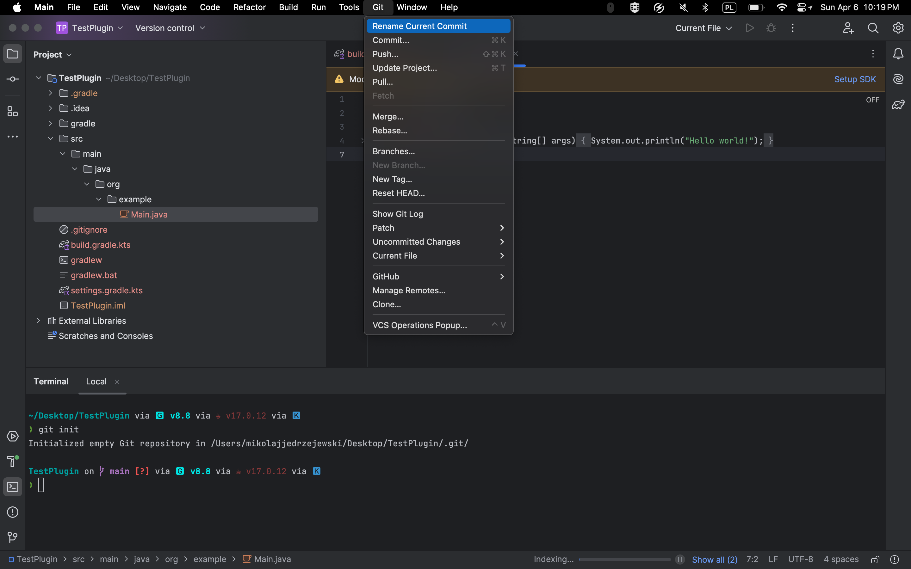
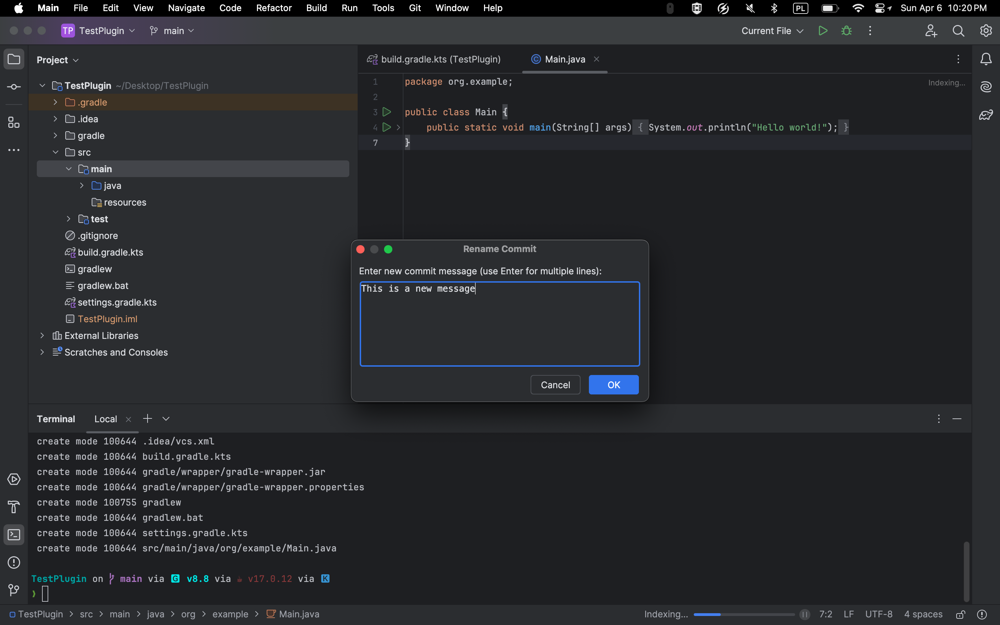

# IntelliJ-Git-Plugin


[](https://plugins.jetbrains.com/plugin/MARKETPLACE_ID)
[](https://plugins.jetbrains.com/plugin/MARKETPLACE_ID)

<!-- Plugin description -->
Rename your latest Git commit directly from IntelliJ IDEA. Features a multi-line input dialog and validation to prevent empty commit messages.
<!-- Plugin description end -->

## Features
- Rename the most recent Git commit via `git commit --amend`.
- Multi-line commit message support.
- Prevents empty messages with a warning and re-prompt.
- Skips amend if the new message matches the current one.
- Error handling for failed amend attempts.

## Installation
- **Manually**: download the [latest release](https://github.com/mikolajed/IntelliJ-Git-Plugin/releases/latest) and install using <kbd>Settings/Preferences</kbd> > <kbd>Plugins</kbd> > <kbd>⚙️</kbd> > <kbd>Install plugin from disk...</kbd>
- **Git**: follow developer guide below.

## Developer Guide
1. **Clone the Repo**:
   ```bash
   git clone https://github.com/mikolajed/IntelliJ-Git-Plugin.git
   cd IntelliJ-Git-Plugin
   ```

2. **Open in IntelliJ IDEA:**  
- Tested on IntelliJ IDEA 2024.3.5 (Ultimate Edition).
- Navigate to <kbd>File > Open</kbd> and select the cloned folder.

3. **Configure Project Structure:**
- Navigate to <kbd>File > Project Structure</kbd>
- Under SDKs, click <kbd>+</kbd> > <kbd>IntelliJ Platform Plugin SDK</kbd> and choose your IDEA install dir.
- Add `git4idea` to the classpath it might be at a different location.
- Select the SDK > <kbd>Classpath</kbd> tab > <kbd>+</kbd> > Navigate to <IDEA_DIR>/plugins/git4idea/lib/git4idea.jar > <kbd>OK</kbd>.
- Apply and close.

  | New project SDK                               | Add Git4Idea to the classpath             |
  |-----------------------------------------------|-------------------------------------------|
  |  |  |


4. **Gradle Sync:**  
- <kbd>File > Sync Project with Gradle Files</kbd> or click the Gradle elephant icon.
- Wait for dependencies (JUnit 5, Mockito) to resolve.

5. **Run the Plugin:**
- In IDEA: <kbd>Run > Run 'Plugin'</kbd>.
- Or via Gradle:  
```bash
./gradlew runIde
```

6. **Test It:**
In the sandbox IDEA instance:  
- Create a simple project.

  | Plugin location                           | Rename current commit                     |
  |--------------------------------------------|-------------------------------------------|
  |  |  |

- Init Git: `git init`, add files, and create a commit (`git commit -m "Initial commit"`).
- Navigate to main toolbar > <kbd>Git</kbd> > <kbd>Rename Current Commit</kbd> and change commit message when prompted.

7. **Build for Distribution:**
In case you make any changes w.r.t. current release version, you can build the plugin with:
```bash
./gradlew buildPlugin
```
